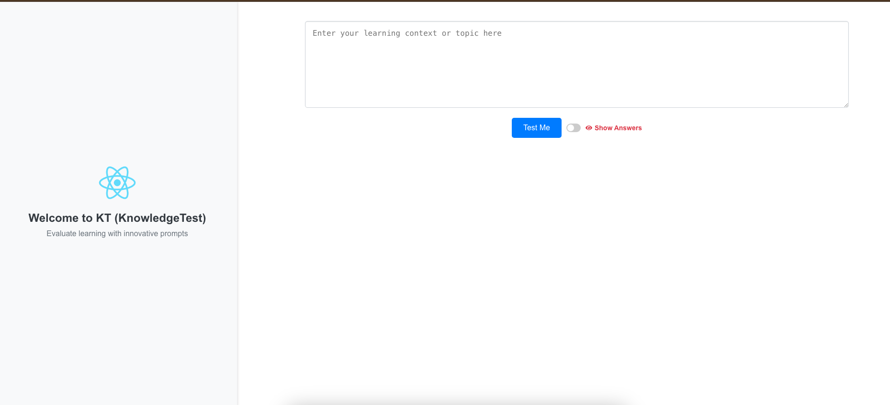
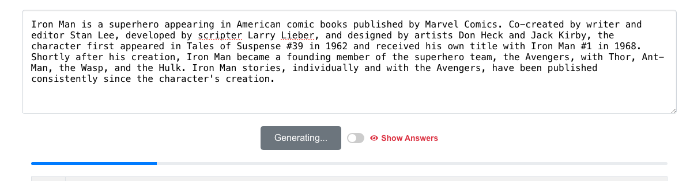
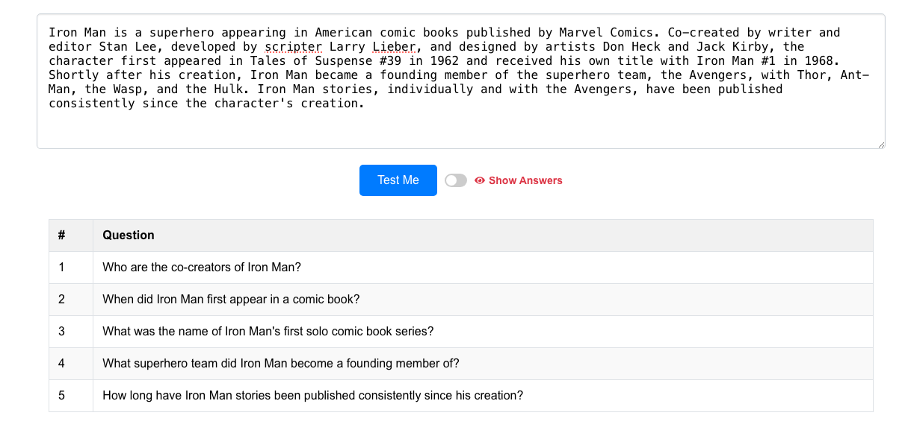
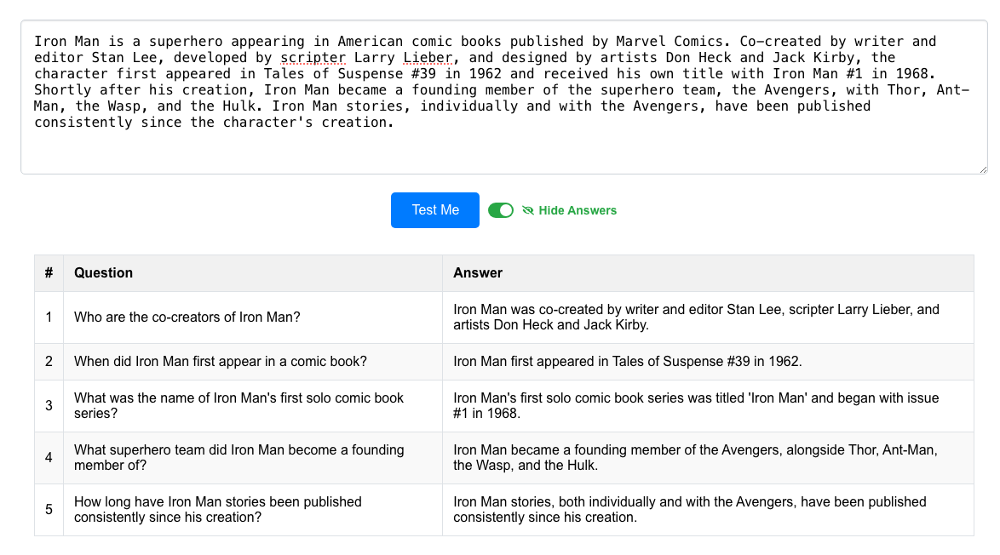

# KT - KnowledgeTest

Welcome to the KnowledgeTest project! This application consists of a **frontend** built with React and a **backend** built with Node.js. The frontend allows users to generate and evaluate learning questions, while the backend provides the API for question generation using the Google Gemini API.

## Table of Contents

- [Frontend (React)](#frontend-react)
  - [Overview](#overview)
  - [Features](#features)
  - [Screenshots](#screenshots)
  - [Getting Started](#getting-started)
  - [Configuration](#configuration)
  - [Running the Application](#running-the-application)

- [Backend (Node.js)](#backend-nodejs)
  - [Overview](#overview-1)
  - [Features](#features-1)
  - [Getting Started](#getting-started-1)
  - [Configuration](#configuration-1)
  - [Running the Server](#running-the-server)
  - [API Endpoints](#api-endpoints)

- [Contact](#contact)

---

## Frontend (React)

### Overview

The KnowledgeTest frontend is a React-based web application designed to help students evaluate their learning through innovative questions based on the context they provide.

### Features

- Upload content (as of now text, in next version files can be uploaded)
- Generate questions based on the uploaded content.
- Display generated questions in a grid.
- Reveal answers for the generated questions.

### Screenshots

#### Home screen
The home screen allows user to upload a file containing the content for which they want to generate questions.


#### Questions Generated
After clicking the "Test Me" button, the application generates questions from the upload content and display them in a grid.



#### Show Answers
Upon clicking "Show Answers", the answers to the generated questions are revealed in the grid.


### Getting Started

#### Prerequisites

Make sure you have the following installed:

- [Node.js](https://nodejs.org/) (version 16 or later recommended)
- [npm](https://www.npmjs.com/get-npm) (comes with Node.js) or [Yarn](https://classic.yarnpkg.com/en/docs/install) (optional)

#### Installation

Clone the repository:

```bash
git clone https://github.com/your-username/knowledge-test-frontend.git
cd frontend
```

Install dependencies:
```
npm install
# or
yarn install
```

### Configuration  
Create a .env file in the root directory and add the API URL for the [backend (Node.js)](#backend-nodejs) :
```
REACT_APP_API_URL=http://localhost:5001  # Replace with your API URL.
```

### Running the Application
Start the development server:
```
npm start
# or
yarn start
```

### Sample output
Home screen

While generating question for the content given

Questions for the given content

Show answer 

Open your browser and visit http://localhost:3000 to see the application in action.
# Backend (Node.js)

Welcome to the KnowledgeTest Backend repository! This Node.js application serves as the backend API for the KnowledgeTest frontend. It generates questions based on the learning context provided by users using the Google Gemini API.

## Overview

The KnowledgeTest backend is a Node.js server application that provides an API endpoint for generating questions based on user-provided learning content. The questions are generated using the Google Gemini API.

## Features

- **Question Generation:** Generates questions from user-provided content.
- **Google Gemini API Integration:** Uses the Google Gemini API to create thoughtful and creative questions.
- **Environment Configuration:** Configurable via environment variables.
- **Error Handling:** Basic error handling for API requests and responses.

## Getting Started

### Prerequisites

Make sure you have the following installed:

- [Node.js](https://nodejs.org/) (version 16 or later recommended)
- [npm](https://www.npmjs.com/get-npm) (comes with Node.js) or [Yarn](https://classic.yarnpkg.com/en/docs/install) (optional)

### Installation

Clone the repository:

```bash
cd server
```

Install dependencies:
```
npm install
# or
yarn install
```

## Configuration
Create a .env file in the root directory with the following environment variables:
```
PORT=5001  # Port on which the server will run
GEMINI_API_KEY=your-gemini-api-key  # Replace with your Google Gemini API key
```

Replace your-gemini-api-key with your actual Google Gemini API key. You can obtain this key from the Google Cloud Console.

## Running the Server
```
npm start
# or
yarn start
```
The server will be available at http://localhost:5001

## API Endpoints
POST /api/generate-questions
Generates questions based on the provided learning context.

Request Body:
```
{
  "content": "Your learning context or topic here"
}

```

Response:
```
{
  "questions": [
    {
      "question": "What happens when Tony Stark's suit malfunctions during a crucial battle, leaving him vulnerable to the enemy?",
      "answer": "Tony Stark's suit malfunctioning could leave him exposed to enemy attacks, leading to a significant disadvantage in the battle."
    },
    {
      "question": "Will Tony Stark's invention of the suit inspire others to create their own, leading to a new era of technological warfare?",
      "answer": "Tony Stark’s invention might inspire others, potentially leading to advancements in technology and the emergence of new technological threats."
    },
    {
      "question": "How will Tony Stark's newfound purpose as a superhero affect his relationships with his family and friends?",
      "answer": "Tony Stark’s superhero role might strain his relationships due to the demands and dangers of his responsibilities."
    },
    {
      "question": "Will Tony Stark's fight against evil forces lead him to uncover a larger conspiracy that threatens the world?",
      "answer": "Tony Stark’s battle against evil forces might reveal a more extensive conspiracy with global implications."
    }
  ]
}

```

## Contact
For any questions/suggestions, you can reach out to sugumar.p@gmail.com